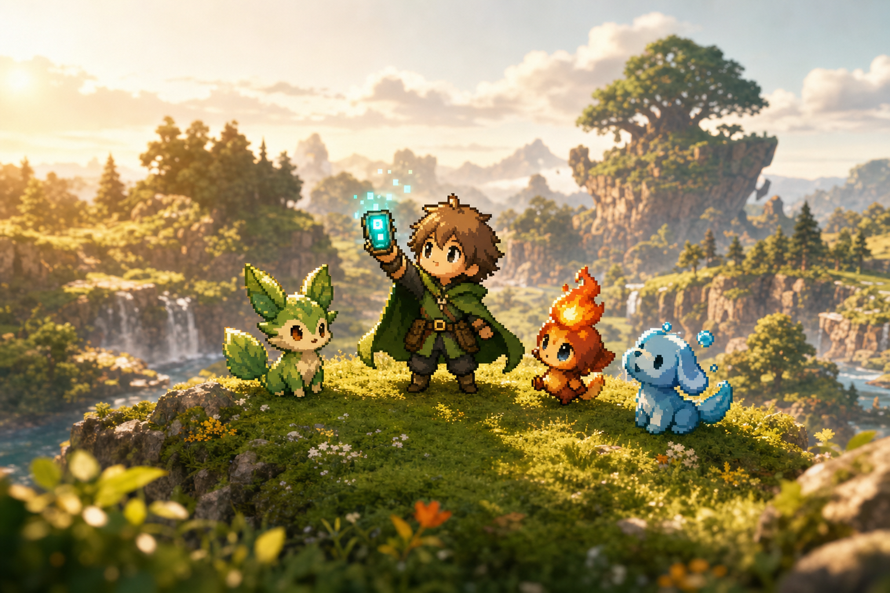

# Gaiamon

**A cute, open-source, community-driven monster-collecting MMO — in your browser.**

No downloads, no ROMs, no legal gray zones. Original creatures, original world,
HD-2.5D diorama look, and every link is a playable session. Built fully in the
open — the repo *is* the dev log.

🎮 **Play:** [gaiamon.com](https://gaiamon.com) *(pre-alpha)*



## What's playable today

Explore **Elowen Vale** as a Warden with an ancient-tech **Codex**: pick one of
three starters (Fernby 🌿, Kindlet 🔥, Puddlop 💧), walk the tall grass of
Petalway Meadow and the Gloam Caverns, battle wild Gaiamon in turn-based
combat (11 original types, stamina pips, 5 status effects), **Sync** the ones
you weaken (no balls here — the Codex projects a resonance glyph), level up,
evolve, take on the three-round **Trial of Echoes**, challenge **Keeper
Solenne**, and wake **Cairnoss**, the Titan that was pretending to be a
waystone. 16 original species, 40 moves, playable one-thumb on your phone.
Progress saves to your browser. Full design bible: [design/DESIGN.md](design/DESIGN.md).

## Why

Monster-collecting MMOs today mean desktop clients and borrowed IP. We think
the genre deserves a game that is:

- **Browser-native** — loads in seconds, works on your phone, shareable as a link
- **Original IP** — our own cute creatures, so the game can exist in daylight:
  streams, ads, app stores, community content
- **Open source** — MIT code, credited open assets, decisions made in public

## Stack

| Layer | Choice | Why |
|---|---|---|
| Client | Three.js + Vite (TypeScript) | Tiny payload, 2.5D HD diorama look (tilted camera, billboard sprites) |
| API | Cloudflare Worker + Hono | Edge-cheap, zero ops |
| Realtime (next) | Durable Objects | One DO per zone = authoritative state; turn-based battles as instanced DOs |
| Persistence (next) | D1 + DO storage | Accounts in D1, live zone state in DOs |
| Art | `gpt-image-2` pipeline + [Screen Smith](https://screensmith.itch.io/) CC packs | Control the aesthetic, stay redistributable — see [CREDITS.md](CREDITS.md) |

**Size budget:** the worker script must stay under 3 MB gzipped (free plan).
All heavy things — client bundle, art, audio — ship as static assets
(20k files / 25 MiB each). Game logic stays lean by design.

## Develop

```bash
bun install
bun run dev:api   # worker on :8787
bun run dev       # client on :5173 (proxies /api → :8787)
```

Deploys happen automatically: push to `main` → GitHub Actions → `wrangler deploy`
→ [gaiamon.com](https://gaiamon.com).

### Art pipeline

```bash
cp .env.example .env   # add your OpenAI key (stays local, gitignored)
bun run gen-art "a sleepy cloud-sheep with a rainbow tuft" art/creatures/nimbaa.png
```

One consistent house style, one still image per creature — animation is tweens
(bob, hop, squash). See [DISCUSSION.md](DISCUSSION.md) for the full design
conversation.

## Contributing

Pre-alpha: things move fast and break often. Issues, PRs, and creature ideas
welcome. Art contributions: note hand-made vs AI-assisted in your PR
([CREDITS.md](CREDITS.md) explains our asset policy).

## License

[MIT](LICENSE). Assets credited in [CREDITS.md](CREDITS.md).
